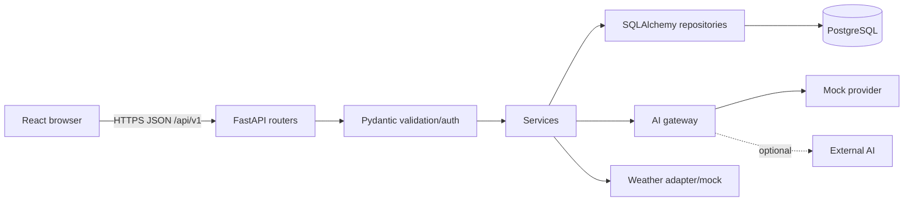
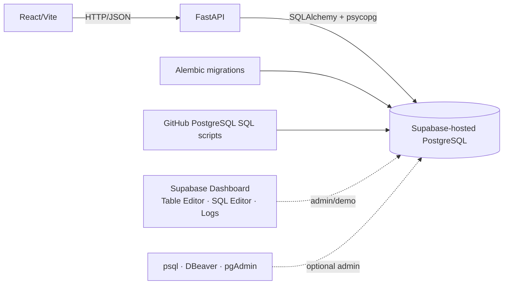

# Architecture

Routes validate transport data. Services own business rules. Repositories alone access PostgreSQL. The AI gateway receives validated trip data plus allow-listed database records, returns schema-validated JSON, and never writes data. The backend transactionally saves accepted plans. React uses one API client and route-level loading/empty/error states.

Deployment units: static frontend, FastAPI process, PostgreSQL, and optional external providers. Configuration comes from environment variables. See `docs/06-system-architecture.md`, `docs/08-api-design.md`, and `docs/09-ai-integration-design.md`.

<!-- SUPABASE_UPDATE_START -->
## Hosted database architecture

PostgreSQL remains the relational DBMS. FastAPI remains the normal and only database access layer for React and owns authentication, authorization, validation and business logic. Supabase does not replace it. Migrations and Git SQL files are reproducible truth: any Dashboard experiment must be recreated and reviewed as Alembic or version-controlled SQL.

No database password or service-role key reaches React. RLS is not the primary authorization mechanism in this server-mediated design; FastAPI enforces ownership. Keep public table exposure disabled. If direct browser access is explicitly introduced later, document the reason, expose at most a public anon key, enable/test ownership-based RLS first, and never expose the service-role key.
<!-- SUPABASE_UPDATE_END -->
