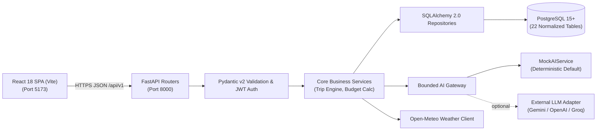

# System Architecture

> **Project:** RoamGenie — AI Travel Planner & Budget Optimizer  
> **Course:** Database Management Systems (Semester 5 Theory & Project)  
> **Architecture Style:** Decoupled 3-Tier Web Application  
> **Authoritative Specification:** [docs/architecture/SYSTEM_ARCHITECTURE.md](docs/architecture/SYSTEM_ARCHITECTURE.md)

---

## 1. High-Level Architecture Topology

---

## 2. Core Security & Decoupling Boundaries

1. **Zero Direct Client Database Access:** The React frontend communicates strictly with FastAPI over HTTP/JSON. No database connection strings, database passwords, or Supabase service-role keys are exposed to the client.
2. **Backend Authentication & Ownership:** FastAPI manages Argon2id password hashing, JWT creation/validation, and resource ownership enforcement (User A cannot access User B's trips).
3. **Bounded AI Context:** AI services receive sanitized, allow-listed catalogue context and return schema-validated JSON. The AI has zero direct database query or write permissions.
4. **Deterministic Fallback:** `DeterministicScheduler` ensures 100% functionality without external API keys or during network outages.

---

## 3. Authoritative Architectural References

* **Complete System Architecture & Design:** [docs/architecture/SYSTEM_ARCHITECTURE.md](docs/architecture/SYSTEM_ARCHITECTURE.md)
* **Architecture Overview:** [docs/architecture/ARCHITECTURE_OVERVIEW.md](docs/architecture/ARCHITECTURE_OVERVIEW.md)
* **Relational Database Architecture:** [docs/database/DATABASE_ARCHITECTURE.md](docs/database/DATABASE_ARCHITECTURE.md)
* **22-Table Data Dictionary:** [docs/database/DATA_DICTIONARY.md](docs/database/DATA_DICTIONARY.md)
* **Architectural Decision Records:** [docs/decisions/ADR_INDEX.md](docs/decisions/ADR_INDEX.md)
