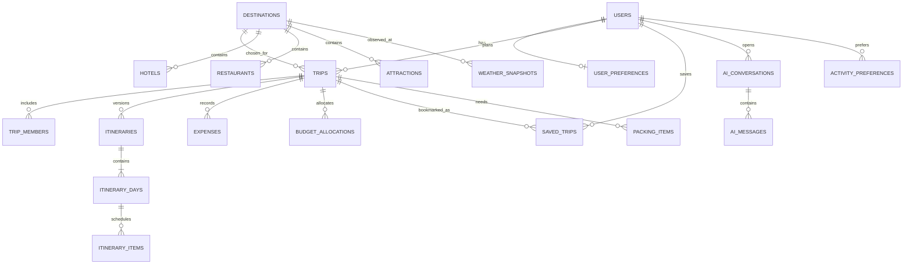

# ER Diagram v1 Draft

Review open decisions at M1: polymorphic review target, itinerary item catalogue reference strategy, transport route normalization and whether user preferences remain one-to-one or become lookup tables.

