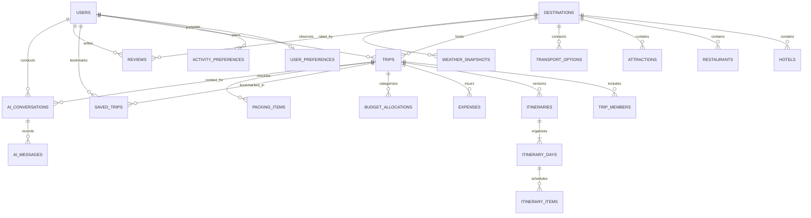

# Entity-Relationship Design (Phase 1 Baseline)

## 1. System ER Diagram

---

## 2. Entity Identification & Cardinality Specifications

### 2.1 User & Identity Management
1. **`users`**
   - **Purpose:** Primary account identity, credential store, and role authorization.
   - **PK:** `id` (BigInteger, Identity)
   - **Candidate Keys:** `email` (Unique)
   - **Relationships:**
     - 1:1 with `user_preferences` (Optional participation on insert, mandatory FK from child)
     - 1:N with `activity_preferences` (0..N activities per user)
     - 1:N with `trips` (0..N trips planned by user)
     - 1:N with `saved_trips` (0..N bookmarked trips)
     - 1:N with `reviews` (0..N destination reviews)
     - 1:N with `ai_conversations` (0..N chat sessions)

2. **`user_preferences`**
   - **Purpose:** Single profile customization record per user.
   - **PK / FK:** `user_id` $\rightarrow$ `users(id)` (`ON DELETE CASCADE`)
   - **Cardinality:** Exactly 1:1 with `users`.

3. **`activity_preferences`**
   - **Purpose:** Normalized multi-valued activity tags for travel recommendations.
   - **Composite PK:** `(user_id, activity)`
   - **FK:** `user_id` $\rightarrow$ `users(id)` (`ON DELETE CASCADE`)
   - **Cardinality:** 1:N from `users`.

---

### 2.2 Travel Catalogues & Master Data
4. **`destinations`**
   - **Purpose:** Master repository of supported travel cities and countries.
   - **PK:** `id` (BigInteger, Identity)
   - **Candidate Keys:** `(city, country)` (Unique)
   - **Relationships:**
     - 1:N with `hotels` (0..N hotels in destination)
     - 1:N with `restaurants` (0..N dining venues)
     - 1:N with `attractions` (0..N tourist sights)
     - 1:N with `transport_options` (0..N arrival/departure routes)
     - 1:N with `weather_snapshots` (0..N historical weather observations)

5. **`hotels`**
   - **Purpose:** Accommodation inventory within a destination.
   - **PK:** `id` (BigInteger, Identity)
   - **FK:** `destination_id` $\rightarrow$ `destinations(id)` (`ON DELETE CASCADE`)
   - **Unique Constraint:** `(destination_id, name)`

6. **`restaurants`**
   - **Purpose:** Food and culinary dining inventory.
   - **PK:** `id` (BigInteger, Identity)
   - **FK:** `destination_id` $\rightarrow$ `destinations(id)` (`ON DELETE CASCADE`)
   - **Unique Constraint:** `(destination_id, name)`

7. **`attractions`**
   - **Purpose:** Sightseeing, heritage, cultural, and activity points of interest.
   - **PK:** `id` (BigInteger, Identity)
   - **FK:** `destination_id` $\rightarrow$ `destinations(id)` (`ON DELETE CASCADE`)
   - **Unique Constraint:** `(destination_id, name)`

8. **`transport_options`**
   - **Purpose:** Travel connection routes between origins and destination.
   - **PK:** `id` (BigInteger, Identity)
   - **FK:** `destination_id` $\rightarrow$ `destinations(id)` (`ON DELETE CASCADE`)

---

### 2.3 Trip Planning & Itinerary Execution
9. **`trips`**
   - **Purpose:** Central trip entity binding user constraints, budget, destination, and dates.
   - **PK:** `id` (BigInteger, Identity)
   - **FKs:** `user_id` $\rightarrow$ `users(id)` (`ON DELETE CASCADE`), `destination_id` $\rightarrow$ `destinations(id)`
   - **Relationships:**
     - 1:N with `trip_members`
     - 1:N with `itineraries` (versioned plans)
     - 1:N with `budget_allocations`
     - 1:N with `expenses`
     - 1:N with `packing_items`

10. **`trip_members`**
    - **Purpose:** Companion travellers accompanying the trip owner.
    - **PK:** `id` (BigInteger, Identity)
    - **FK:** `trip_id` $\rightarrow$ `trips(id)` (`ON DELETE CASCADE`)

11. **`itineraries`**
    - **Purpose:** Versioned daily travel schedule generated by AI or configured by user.
    - **PK:** `id` (BigInteger, Identity)
    - **FK:** `trip_id` $\rightarrow$ `trips(id)` (`ON DELETE CASCADE`)
    - **Unique Constraint:** `(trip_id, version)`

12. **`itinerary_days`**
    - **Purpose:** Calendar day container within an itinerary version.
    - **PK:** `id` (BigInteger, Identity)
    - **FK:** `itinerary_id` $\rightarrow$ `itineraries(id)` (`ON DELETE CASCADE`)
    - **Unique Constraint:** `(itinerary_id, day_number)`

13. **`itinerary_items`**
    - **Purpose:** Individual scheduled activity, dining, travel, or lodging event.
    - **PK:** `id` (BigInteger, Identity)
    - **FK:** `itinerary_day_id` $\rightarrow$ `itinerary_days(id)` (`ON DELETE CASCADE`)
    - **Unique Constraint:** `(itinerary_day_id, item_order)`

---

### 2.4 Financials, Checklist & Reviews
14. **`budget_allocations`**
    - **Purpose:** Category-wise target spending caps (accommodation, food, transport, activities).
    - **PK:** `id` (BigInteger, Identity)
    - **FK:** `trip_id` $\rightarrow$ `trips(id)` (`ON DELETE CASCADE`)
    - **Unique Constraint:** `(trip_id, category)`

15. **`expenses`**
    - **Purpose:** Actual recorded expenditure incurred during a trip.
    - **PK:** `id` (BigInteger, Identity)
    - **FK:** `trip_id` $\rightarrow$ `trips(id)` (`ON DELETE CASCADE`)

16. **`saved_trips`**
    - **Purpose:** User bookmarks / trip templates for quick reopening.
    - **PK:** `id` (BigInteger, Identity)
    - **FKs:** `user_id` $\rightarrow$ `users(id)` (`CASCADE`), `trip_id` $\rightarrow$ `trips(id)` (`CASCADE`)
    - **Unique Constraint:** `(user_id, trip_id)`

17. **`reviews`**
    - **Purpose:** User feedback and 1–5 star ratings on destinations.
    - **PK:** `id` (BigInteger, Identity)
    - **FKs:** `user_id` $\rightarrow$ `users(id)` (`CASCADE`), `destination_id` $\rightarrow$ `destinations(id)` (`CASCADE`)
    - **Unique Constraint:** `(user_id, destination_id)`

18. **`packing_items`**
    - **Purpose:** Trip checklist with completion status.
    - **PK:** `id` (BigInteger, Identity)
    - **FK:** `trip_id` $\rightarrow$ `trips(id)` (`ON DELETE CASCADE`)
    - **Unique Constraint:** `(trip_id, item)`

---

### 2.5 AI & Operational Support
19. **`ai_conversations` & `ai_messages`**
    - **Purpose:** Persistent chat context between traveller and AI assistant.
    - **FKs:** `user_id` $\rightarrow$ `users(id)`, `trip_id` $\rightarrow$ `trips(id)` (`ON DELETE SET NULL`)

20. **`weather_snapshots`**
    - **Purpose:** Point-in-time climate observations for destination travel advice.
    - **FK:** `destination_id` $\rightarrow$ `destinations(id)` (`ON DELETE CASCADE`)

21. **`trip_audit`**
    - **Purpose:** Immutable operational audit log capturing before/after JSON states of trip updates.
