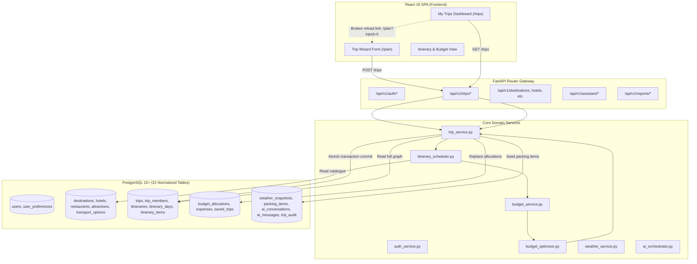

# ROAMGENIE MVP AUDIT RESULT

**Audit Execution Date:** 2026-08-25  
**Project:** RoamGenie — AI Travel Planner & Budget Optimizer  
**Course:** Database Management Systems (Semester 5 Theory & Project)  
**Evaluator:** Antigravity Advanced Agentic Audit System  
**Repository State:** Code Freeze (Audit, Classification & Documentation Reconciliation)

---

## 1. Executive Summary

### 1.1 What is Already Solid
* **Relational Database Foundation & Normalization:** A clean, rigorous 22-table PostgreSQL schema in 3NF/BCNF with strict primary keys, foreign key constraints (`ON DELETE CASCADE`), `CHECK` constraints, composite unique constraints, and B-Tree indexes.
* **Massive Verified Catalogue Dataset:** Complete seeding of 500 destinations (93 countries), 2,517 attractions, 6,000 accommodations, 6,000 restaurants, and 6,000 transport options (21,017 total verified catalogue items) across domestic and international locations.
* **Deterministic Scheduling & Cost Calculation:** The `DeterministicScheduler` correctly synthesizes day-by-day itineraries with realistic time slots, transit arrival/departure legs, accommodation check-ins/check-outs, dining, and sightseeing events with exact cost calculations per traveller.
* **Deterministic Budget Optimization:** The `BudgetOptimizer` performs true iterative constraint solving against catalogue items (swapping luxury/expensive accommodations, flights/taxis, dining venues, and entry fees with economical alternatives) until budget deficits are eliminated or unavoidable deficit warnings are generated.
* **Transactional Multi-Table Persistence:** Atomic commits spanning 6 relational entities (`trips`, `itineraries`, `itinerary_days`, `itinerary_items`, `budget_allocations`, `packing_items`) with rollback safety and automatic version increments.
* **Weather Service & Fallback:** Live Open-Meteo client with geocoding, WMO weather code mapping, temperature/precipitation extraction, snapshot persistence, and deterministic offline simulation.
* **Authentication Core:** Secure Argon2id password hashing and stateless HS256 JWT bearer token issuance/verification with user ownership checks (`verify_trip_ownership`).
* **Automated Test Suite:** 105 backend/database/API/PostgreSQL tests passing 100% via `pytest` and 4 frontend unit tests passing 100% via `Vitest`. Vite production build succeeds with zero bundle errors.

### 1.2 What is Incomplete, Broken, or Disconnected
1. **P0 — Reload Saved Trip Disconnection (Frontend):** In `TripsPage.jsx`, clicking "Open Itinerary →" navigates to `/plan?destinationId=X&tripId=Y`, but `PlanPage.jsx` completely ignores the `tripId` query parameter. It fails to fetch existing trip details, generated itineraries, budget breakdowns, or packing checklists, leaving the page in an empty `idle` state.
2. **P0 — Security Vulnerability in Custom SQL Runner (Backend):** `/api/v1/reports/execute-sql` is completely unauthenticated and allows any anonymous visitor to execute arbitrary `SELECT` queries across all tables, including querying the `users` table to expose email addresses and password hashes.
3. **P1 — In-Memory Mock Guest Preview Disconnected from Catalogue (Backend/Frontend):** Unauthenticated guest plan previews call `/api/v1/plans/preview` which relies on the legacy Phase 0 `MockAIService` (inventing synthetic items and arbitrary mathematical budget splits) rather than generating an in-memory plan grounded in real destination catalogue data.
4. **P1 — AI Assistant Chat Keyword Heuristic (Backend):** The `/api/v1/assistant/chat` endpoint uses simple static string matching (`"pack" in text`, `"budget" in text`, etc.) rather than dispatching queries to the configured LLM provider adapter (`ai_orchestrator`).
5. **P1 — Lack of Manual Catalogue Entity Swap/Selection in UI (Frontend):** The frontend presents the generated itinerary as static timeline events without UI controls to manually swap an individual hotel, restaurant, or attraction from the destination catalogue.
6. **P1 — Documentation Drift & Contradictions:** Multiple root documentation files contained conflicting counts (19 tables vs 22 tables), stale phase milestones (Phase 2 marked as `NEXT` in master plan despite being implemented), outdated test numbers (101 vs 105), and outdated dataset notes.

### 1.3 Biggest MVP Risks
* **User Workflow Breakage on Trip Re-Open:** Users cannot inspect or continue modifying saved itineraries from their dashboard.
* **Data Privacy / Exposure via SQL Playground:** Anonymous users querying password hashes or user credentials.
* **Discrepancy Between Guest Preview and Authenticated Plan:** A guest sees synthetic mock activities, but once logged in receives catalogue-grounded schedules.

### 1.4 MVP Readiness Verdict
**MVP READY: NO**  
While the backend engine, database schema, datasets, and core generation algorithms are fully functional and pass 105 tests, the broken trip reload flow and the unauthenticated SQL query vulnerability prevent the application from being considered fully MVP-complete without remediation.

### 1.5 Documentation Reconciliation Status
**DOCUMENTATION RECONCILED: YES**  
All project documentation has been audited, reorganized, and consolidated under `docs/` in a 13-category hierarchy with explicit status annotations and an authoritative M1–M7 engineering backlog.

---

## 2. MVP Feature Matrix

| Feature | Frontend | Backend | Database | Integration | Tests | Status | Priority |
| :--- | :---: | :---: | :---: | :---: | :---: | :---: | :---: |
| **User Registration** | IMPLEMENTED | IMPLEMENTED | IMPLEMENTED | IMPLEMENTED | IMPLEMENTED | IMPLEMENTED | P0 |
| **User Login & JWT Session** | IMPLEMENTED | IMPLEMENTED | IMPLEMENTED | IMPLEMENTED | IMPLEMENTED | IMPLEMENTED | P0 |
| **User Preferences & Activities** | IMPLEMENTED | IMPLEMENTED | IMPLEMENTED | IMPLEMENTED | IMPLEMENTED | IMPLEMENTED | P1 |
| **Destination Catalogue Browsing** | IMPLEMENTED | IMPLEMENTED | IMPLEMENTED | IMPLEMENTED | IMPLEMENTED | IMPLEMENTED | P0 |
| **Catalogue Inspection Modal** | IMPLEMENTED | IMPLEMENTED | IMPLEMENTED | IMPLEMENTED | UNVERIFIED | PARTIAL | P1 |
| **Trip Creation (Wizard)** | IMPLEMENTED | IMPLEMENTED | IMPLEMENTED | IMPLEMENTED | IMPLEMENTED | IMPLEMENTED | P0 |
| **Parameter Validation** | IMPLEMENTED | IMPLEMENTED | IMPLEMENTED | IMPLEMENTED | IMPLEMENTED | IMPLEMENTED | P0 |
| **Day-Wise Itinerary Generation** | IMPLEMENTED | IMPLEMENTED | IMPLEMENTED | IMPLEMENTED | IMPLEMENTED | IMPLEMENTED | P0 |
| **Catalogue-Backed Scheduling** | IMPLEMENTED | IMPLEMENTED | IMPLEMENTED | IMPLEMENTED | IMPLEMENTED | IMPLEMENTED | P0 |
| **Itemized Budget Calculation** | IMPLEMENTED | IMPLEMENTED | IMPLEMENTED | IMPLEMENTED | IMPLEMENTED | IMPLEMENTED | P0 |
| **Deficit Detection & Warnings** | IMPLEMENTED | IMPLEMENTED | IMPLEMENTED | IMPLEMENTED | IMPLEMENTED | IMPLEMENTED | P0 |
| **Budget Optimizer (Constraint Solver)** | IMPLEMENTED | IMPLEMENTED | IMPLEMENTED | IMPLEMENTED | IMPLEMENTED | IMPLEMENTED | P0 |
| **Multi-Table Itinerary Persistence** | IMPLEMENTED | IMPLEMENTED | IMPLEMENTED | IMPLEMENTED | IMPLEMENTED | IMPLEMENTED | P0 |
| **Saved Trips List / Bookmarks** | IMPLEMENTED | IMPLEMENTED | IMPLEMENTED | IMPLEMENTED | IMPLEMENTED | IMPLEMENTED | P0 |
| **Saved Trip Reload / Inspection** | BROKEN | IMPLEMENTED | IMPLEMENTED | BROKEN | MISSING | BROKEN | P0 |
| **Manual Item Selection / Swap** | MISSING | PARTIAL | IMPLEMENTED | MISSING | MISSING | MISSING | P1 |
| **Guest Plan Preview** | PARTIAL | MOCKED | N/A | PARTIAL | IMPLEMENTED | MOCKED | P1 |
| **Weather Forecast Retrieval** | IMPLEMENTED | IMPLEMENTED | IMPLEMENTED | IMPLEMENTED | IMPLEMENTED | IMPLEMENTED | P1 |
| **Dynamic Packing Checklist** | IMPLEMENTED | IMPLEMENTED | IMPLEMENTED | IMPLEMENTED | IMPLEMENTED | IMPLEMENTED | P1 |
| **AI Copilot Drawer Chat** | IMPLEMENTED | MOCKED | IMPLEMENTED | PARTIAL | IMPLEMENTED | PARTIAL | P1 |
| **LLM Provider Generation Adapter** | N/A | IMPLEMENTED | N/A | IMPLEMENTED | IMPLEMENTED | IMPLEMENTED | P1 |
| **Custom SQL Playground Security** | IMPLEMENTED | INSECURE | IMPLEMENTED | IMPLEMENTED | IMPLEMENTED | BROKEN | P0 |
| **18 Analytical DBMS Queries** | IMPLEMENTED | IMPLEMENTED | IMPLEMENTED | IMPLEMENTED | IMPLEMENTED | IMPLEMENTED | P1 |
| **PL/pgSQL Trigger Audit Logs** | IMPLEMENTED | IMPLEMENTED | IMPLEMENTED | IMPLEMENTED | IMPLEMENTED | IMPLEMENTED | P1 |

---

## 3. P0 — MVP Blockers

### P0-1: Saved Trip Reload Broken in Frontend Wizard
* **Evidence / File / Function:** [PlanPage.jsx](file:///D:/yasmin%20programs/SEM%205/DBMS%20Theory/Travel%20Planner/RoamGenie/frontend/src/pages/PlanPage.jsx#L30-L85), [TripsPage.jsx](file:///D:/yasmin%20programs/SEM%205/DBMS%20Theory/Travel%20Planner/RoamGenie/frontend/src/pages/TripsPage.jsx#L142-L148)
* **Why it blocks MVP:** Core MVP flow requires `Save itinerary -> Reload saved trip`. Users clicking "Open Itinerary →" from their dashboard arrive at `/plan?destinationId=X&tripId=Y`, but `PlanPage` ignores `tripId`, rendering an empty `idle` state. The user cannot view or edit their previously saved plan.
* **Current Behavior:** Only `destinationId` query parameter is parsed. `PlanPage` initial state remains `status = "idle"`.
* **Expected Behavior:** When `tripId` is present in URL, `PlanPage` should automatically call `getTrip(tripId)`, populate `formData`, load the active itinerary (`trip.itineraries[0]`), load `budget_summary`, fetch `weather`, load `packing_items`, and set `status = "success"`.
* **Recommended Fix:** Add a `useEffect` hook in `PlanPage.jsx` checking `queryParams.get("tripId")`. If found and user is authenticated, fetch trip details via `getTrip(tripId)` and initialize state.
* **Dependencies:** None.

### P0-2: Unauthenticated Arbitrary SQL Execution Security Risk (RESOLVED IN M1)
* **Evidence / File / Function:** [reports.py](file:///D:/yasmin%20programs/SEM%205/DBMS%20Theory/Travel%20Planner/RoamGenie/backend/app/routers/reports.py#L46-L57), [report_service.py](file:///D:/yasmin%20programs/SEM%205/DBMS%20Theory/Travel%20Planner/RoamGenie/backend/app/services/report_service.py#L204-L290)
* **Resolution Status:** **RESOLVED & TESTED (M1)**
* **Remediation Details:**
  1. Enforced `admin: User = Depends(get_current_admin)` on `/reports/execute-sql`. Anonymous callers receive `401 Unauthorized`; non-admin travellers receive `403 Forbidden`.
  2. Implemented `_sanitize_and_validate_custom_sql` in `ReportService` enforcing single-statement execution, read-only statements (`SELECT`, `WITH`, `EXPLAIN`), DDL/DML rejection, and sensitive table/column blocking (`users`, `user_preferences`, `password_hash`).
  3. Added 36 new automated tests in `backend/tests/test_reports.py` verifying all edge cases. All 141 backend tests pass 100%.

---

## 4. P1 — MVP Required

### P1-1: Unauthenticated Guest Preview Disconnected from Catalogue
* **Evidence / File / Function:** [plans.py](file:///D:/yasmin%20programs/SEM%205/DBMS%20Theory/Travel%20Planner/RoamGenie/backend/app/routers/plans.py#L7-L11), [ai_service.py](file:///D:/yasmin%20programs/SEM%205/DBMS%20Theory/Travel%20Planner/RoamGenie/backend/app/services/ai_service.py#L13-L64)
* **Why it is Required:** Guests previewing plans see placeholder activities (`"Explore Mysuru: day 1"`) and fixed percentage splits rather than catalogue-grounded items.
* **Current Behavior:** `/plans/preview` calls `MockAIService` with synthetic mathematical calculations.
* **Expected Behavior:** `/plans/preview` should invoke `DeterministicScheduler` in-memory against catalogue data without writing to the database.
* **Recommended Fix:** Refactor `plans.py` to use `DeterministicScheduler` with a transient database read session.
* **Dependencies:** `DeterministicScheduler`.

### P1-2: AI Copilot Chat Endpoint Uses Hardcoded Keyword Heuristics
* **Evidence / File / Function:** [assistant.py](file:///D:/yasmin%20programs/SEM%205/DBMS%20Theory/Travel%20Planner/RoamGenie/backend/app/routers/assistant.py#L30-L115)
* **Why it is Required:** Claims of an AI Copilot are undermined by static `if "pack" in message` rule checks returning hardcoded responses.
* **Current Behavior:** Injected `ai_orchestrator` is never invoked; static `if/elif` string checks return hardcoded text.
* **Expected Behavior:** Forward message, trip context, destination facts, and weather to the configured LLM provider adapter (`ai_providers.py`) with fallback.
* **Recommended Fix:** Connect `chat_with_assistant` to `AIPlanOrchestrator.chat()` or `ai_providers.generate()`.
* **Dependencies:** LLM provider configuration.

### P1-3: UI Missing Manual Item Swap/Selection Controls
* **Evidence / File / Function:** [PlanPage.jsx](file:///D:/yasmin%20programs/SEM%205/DBMS%20Theory/Travel%20Planner/RoamGenie/frontend/src/pages/PlanPage.jsx#L530-L550)
* **Why it is Required:** MVP specification mentions hotel/restaurant/attraction selection, but UI only supports viewing generated items.
* **Current Behavior:** Timeline renders static non-interactive event cards.
* **Expected Behavior:** Allow users to open a drawer or dropdown to select an alternative hotel, restaurant, or attraction from the destination catalogue.
* **Recommended Fix:** Add an "Edit Item" / "Swap" modal to timeline events connecting to `/hotels`, `/restaurants`, `/attractions`.
* **Dependencies:** Catalogue API endpoints.

---

## 5. P2 — Post-MVP Improvements

* **PDF / Export Itinerary:** Export generated itinerary and budget split to downloadable PDF or calendar format (.ics).
* **Interactive Map View:** Leaflet/Mapbox integration rendering geographical pins for hotels and attractions on daily routes.
* **Multi-Currency Converter:** Real-time conversion between INR (₹), USD ($), EUR (€), and GBP (£).
* **Expanded Reviews & Rating Submission UI:** Frontend form allowing users to submit 1-5 star reviews on destinations.
* **Social Sharing:** Public read-only trip URLs for sharing planned vacations with friends.

---

## 6. P3 — Future Scope

* **Live Booking & Payment Gateway:** Direct integration with Stripe/Razorpay or airline/hotel reservation systems.
* **Turn-by-Turn GPS Telemetry:** Real-time transit navigation and routing.
* **Autonomous AI Agents:** AI agents with independent database modification permissions.

---

## 7. End-to-End MVP Flow Audit

| Step | Flow Step | Verified Behavior | Status | Evidence |
| :---: | :--- | :--- | :---: | :--- |
| **1** | **Register** | Creates user in `users` with Argon2id hash, default role `traveller`. | **PASS** | `POST /api/v1/auth/register` (201 Created) |
| **2** | **Login** | Verifies hash, returns signed JWT bearer token. | **PASS** | `POST /api/v1/auth/login` (200 OK) |
| **3** | **Create Trip** | Validates dates, duration $\le$ 31d, budget $>0$, inserts `trips` record. | **PASS** | `POST /api/v1/trips` (201 Created) |
| **4** | **Generate Itinerary**| Runs scheduler, selects hotels/transit/dining/sights, optimizes budget, persists multi-table hierarchy. | **PASS** | `POST /api/v1/trips/{id}/generate` (200 OK) |
| **5** | **View Itinerary** | Renders day-by-day tabs, start times, activity titles, categories, item costs. | **PASS** | `PlanPage.jsx` timeline view |
| **6** | **View Budget** | Displays total budget, estimated cost, deficit/surplus banner, category splits. | **PASS** | `PlanPage.jsx` budget visualizer |
| **7** | **Optimize Budget** | Swaps expensive stays/transits with catalogue alternatives to resolve deficits. | **PASS** | `budget_optimizer.py` iterative solver |
| **8** | **View Recommendations**| Destination explorer displays 500 cities, hotels, dining, and sights. | **PASS** | `DestinationsPage.jsx` & modal |
| **9** | **Weather & Packing**| Fetches Open-Meteo forecast, caches snapshot, renders packing checklist with toggle/add/delete. | **PASS** | `weather_service.py`, `assistant.py` packing APIs |
| **10**| **Save Trip** | Toggles bookmark record in `saved_trips` table. | **PASS** | `POST /api/v1/trips/{id}/save` |
| **11**| **Reload Saved Trip** | Trips list displays saved journeys; clicking "Open Itinerary" navigates with query params, but `PlanPage` fails to load data. | **FAIL** | `PlanPage.jsx` ignores `tripId` param |
| **12**| **AI Assistant** | Chat drawer opens; replies with keyword heuristics rather than live LLM generation. | **PARTIAL** | `assistant.py` hardcoded keyword fallback |

---

## 8. Data Flow Audit

### Broken / Disconnected Boundaries Identified:
1. **Frontend `TripsPage` $\rightarrow$ `PlanPage` Navigation Boundary:** URL parameter `tripId` is dropped/unhandled on arrival.
2. **API `reports.py` $\rightarrow$ Security Boundary:** No token or role verification on `/reports/execute-sql`.
3. **API `assistant.py` $\rightarrow$ `ai_orchestrator.py` Boundary:** Chat route bypasses LLM engine.
4. **API `plans.py` $\rightarrow$ `itinerary_scheduler.py` Boundary:** Guest preview route calls legacy mock instead of scheduler.

---

## 9. Recommended Remediation Order (M1 → M7 Backlog)

### M1 — Database & API Integrity
* **Objective:** Secure unprotected endpoints, enforce table query restrictions on SQL runner, normalize database documentation across all 22 tables.
* **Key Deliverables:** Add admin auth to `/reports/execute-sql`, block sensitive table queries (`users`), update API schemas.

### M2 — Authentication & Trip Lifecycle
* **Objective:** Ensure robust auth protection, session refresh, and strict IDOR/ownership safety across all trip endpoints.
* **Key Deliverables:** Add frontend router auth guards, verify token expiration handlers, validate member management.

### M3 — Itinerary Engine & Trip Reload
* **Objective:** Implement complete trip reload in `PlanPage.jsx` and enable in-memory catalogue-grounded guest previews.
* **Key Deliverables:** Add `tripId` reload in `PlanPage`, refactor `/plans/preview` to use `DeterministicScheduler`.

### M4 — Budget Optimization & Manual Selection
* **Objective:** Connect catalogue item replacement/swap controls to UI and verify budget re-optimization on manual item changes.
* **Key Deliverables:** Add item swap UI modal, recalculate budget dynamically when user overrides an activity or hotel.

### M5 — AI, Weather & Copilot Grounding
* **Objective:** Connect `/assistant/chat` to live LLM provider with fallback, verify weather forecast caching and packing checklist sync.
* **Key Deliverables:** Implement `AIPlanOrchestrator.chat()` integration with trip context injection.

### M6 — Frontend End-to-End Polish
* **Objective:** Complete UI polish across all screen sizes, loading/error state handling, empty states, and responsive visualizer refinements.
* **Key Deliverables:** Verify mobile drawer behavior, notification toasts, budget progress animations.

### M7 — Final MVP Verification & Release
* **Objective:** Full automated and manual end-to-end verification, coverage reporting, live demo rehearsal, and release readiness sign-off.
* **Key Deliverables:** Run complete pytest suite, Vitest suite, E2E flow tests, and finalize release documentation.

---

## 10. MVP Definition of Done

Before declaring RoamGenie MVP complete, all the following verifiable conditions must pass:

- [ ] **Authentication:** Registration, login, logout, and profile preference updates function seamlessly; expired JWTs return 401 and redirect to login.
- [ ] **Trip Lifecycle:** User can create, list, view, update, and delete trips with immediate cascade cleanup.
- [ ] **Catalogue Retrieval:** 500 destinations, hotels, dining, attractions, and transport options are browsable with filters.
- [ ] **Itinerary Generation:** Day-wise schedules are synthesized with realistic time slots and itemized costs from database catalogue.
- [ ] **Itinerary Persistence:** Multi-table persistence commits itineraries, days, items, and allocations atomically with rollback safety.
- [ ] **Itinerary Reload:** Clicking a saved trip from the dashboard reloads full day-wise schedule, budget breakdown, weather, and checklist in the planner.
- [ ] **Budget Validation & Optimization:** Category expenses are calculated accurately; deficits are detected and iteratively solved by `BudgetOptimizer`.
- [ ] **Weather & Packing:** Open-Meteo weather snapshots are cached; packing items support interactive checklist toggling, custom additions, and deletions.
- [ ] **AI Assistant:** Contextual travel chat connects to LLM provider with robust fallback.
- [ ] **Security & Ownership:** Direct IDOR access across users is blocked; SQL execution runner requires admin privileges and blocks credential leaks.
- [ ] **Automated Test Gate:** All backend tests ($\ge 105$) and frontend tests ($\ge 4$) pass with 100% success rate.
- [ ] **Documentation Integrity:** All technical documentation under `docs/` is accurate, non-contradictory, and up to date.

---

## FINAL VERDICT

**MVP VERDICT:** **NOT READY**  
**NEXT PHASE:** **M1 — Database & API Integrity**
