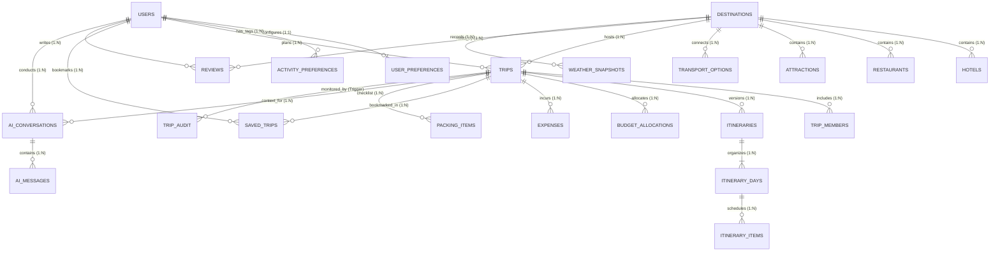

# Database Architecture & Relational Engineering

**Project:** RoamGenie — AI Travel Planner & Budget Optimizer  
**Course:** Database Management Systems (Semester 5 Theory & Project)  
**Target Engine:** PostgreSQL 15+ (Hosted on Supabase)  
**Schema Definition:** 22 Normalized Relational Tables (3NF/BCNF)  
**Status:** Authoritative Relational Architecture (Reconciled Baseline)

---

## 1. Relational Schema Architecture (22 Tables)

The RoamGenie schema is structured into five cohesive relational modules:

```
┌────────────────────────────────────────────────────────────────────────┐
│                   ROAMGENIE DATABASE MODULES (22 TABLES)               │
├────────────────────────────────────────────────────────────────────────┤
│ 1. Identity & Profile Module:                                          │
│    • users               (Primary account identity, email & password)  │
│    • user_preferences    (1:1 profile accommodation & dining style)    │
│    • activity_preferences (1:N multi-valued travel activity tags)      │
│                                                                        │
│ 2. Travel Catalogue Master Data:                                       │
│    • destinations        (500 global cities, countries, daily cost)    │
│    • hotels              (6,000 accommodations with pricing & rating)  │
│    • restaurants         (6,000 dining spots with cuisine & price)     │
│    • attractions         (2,517 sights, entry fees & categories)       │
│    • transport_options   (6,000 intercity/local routes with duration)  │
│                                                                        │
│ 3. Trip Planning & Scheduling Engine:                                  │
│    • trips               (Central trip record, constraints & budget)   │
│    • trip_members        (Companion travellers per trip)               │
│    • itineraries         (Versioned generated travel plans)            │
│    • itinerary_days      (Calendar day containers per itinerary)       │
│    • itinerary_items     (Scheduled activity, dining & transit events) │
│                                                                        │
│ 4. Financials, Bookmarks & Feedback:                                   │
│    • budget_allocations  (Category spending allocations)               │
│    • expenses            (Actual itemized expenses incurred)           │
│    • saved_trips         (User bookmarks & favorite itineraries)       │
│    • reviews             (Destination ratings & feedback)              │
│    • packing_items       (Dynamic trip packing checklist items)        │
│                                                                        │
│ 5. AI Operational & Audit Tracking:                                    │
│    • ai_conversations    (Chat context sessions per user/trip)         │
│    • ai_messages         (Sequential message history with role tags)   │
│    • weather_snapshots   (Cached climate observations)                 │
│    • trip_audit          (PL/pgSQL trigger before/after JSONB log)     │
└────────────────────────────────────────────────────────────────────────┘
```

---

## 2. Entity-Relationship (ER) Model



---

## 3. Relational Table Constraints & Cascades

| Table | Primary Key | Foreign Keys | Unique Constraints | Check Constraints |
| :--- | :--- | :--- | :--- | :--- |
| `users` | `id` (Identity) | None | `email` | `role IN ('traveller', 'admin')` |
| `user_preferences` | `user_id` | `user_id -> users.id` (CASCADE) | None | None |
| `activity_preferences` | `(user_id, activity)` | `user_id -> users.id` (CASCADE) | None | None |
| `destinations` | `id` (Identity) | None | `(city, country)` | `average_daily_cost >= 0` |
| `hotels` | `id` (Identity) | `destination_id -> destinations.id` (CASCADE) | `(destination_id, name)` | `price_per_night >= 0`, `rating BETWEEN 0 AND 5` |
| `restaurants` | `id` (Identity) | `destination_id -> destinations.id` (CASCADE) | `(destination_id, name)` | `average_cost_per_person >= 0`, `rating BETWEEN 0 AND 5` |
| `attractions` | `id` (Identity) | `destination_id -> destinations.id` (CASCADE) | `(destination_id, name)` | `entry_fee >= 0`, `rating BETWEEN 0 AND 5` |
| `transport_options` | `id` (Identity) | `destination_id -> destinations.id` (CASCADE) | None | `estimated_cost >= 0`, `duration_minutes > 0` |
| `trips` | `id` (Identity) | `user_id -> users.id` (CASCADE), `destination_id -> destinations.id` | None | `traveller_count > 0`, `total_budget > 0`, `estimated_total >= 0`, `end_date >= start_date`, `status IN ('draft','planned','completed','cancelled')` |
| `trip_members` | `id` (Identity) | `trip_id -> trips.id` (CASCADE) | None | None |
| `itineraries` | `id` (Identity) | `trip_id -> trips.id` (CASCADE) | `(trip_id, version)` | `version > 0` |
| `itinerary_days` | `id` (Identity) | `itinerary_id -> itineraries.id` (CASCADE) | `(itinerary_id, day_number)` | `day_number > 0` |
| `itinerary_items` | `id` (Identity) | `itinerary_day_id -> itinerary_days.id` (CASCADE) | `(itinerary_day_id, item_order)` | `item_order > 0`, `estimated_cost >= 0` |
| `budget_allocations` | `id` (Identity) | `trip_id -> trips.id` (CASCADE) | `(trip_id, category)` | `amount >= 0` |
| `expenses` | `id` (Identity) | `trip_id -> trips.id` (CASCADE) | None | `amount >= 0` |
| `saved_trips` | `id` (Identity) | `user_id -> users.id` (CASCADE), `trip_id -> trips.id` (CASCADE) | `(user_id, trip_id)` | None |
| `reviews` | `id` (Identity) | `user_id -> users.id` (CASCADE), `destination_id -> destinations.id` (CASCADE) | `(user_id, destination_id)` | `rating BETWEEN 1 AND 5` |
| `ai_conversations` | `id` (Identity) | `user_id -> users.id` (CASCADE), `trip_id -> trips.id` (SET NULL) | None | None |
| `ai_messages` | `id` (Identity) | `conversation_id -> ai_conversations.id` (CASCADE) | None | `role IN ('user', 'assistant', 'system')` |
| `weather_snapshots` | `id` (Identity) | `destination_id -> destinations.id` (CASCADE) | None | None |
| `packing_items` | `id` (Identity) | `trip_id -> trips.id` (CASCADE) | `(trip_id, item)` | None |
| `trip_audit` | `id` (Identity) | `trip_id` (Unenforced historical log) | None | None |

---

## 4. Advanced Relational Objects

### 4.1 Database Views (`database/views/001_views.sql`)
1. **`v_trip_budget_summary`:** Computes allocated budget, estimated costs, remaining funds, and deficit flags across trips.
2. **`v_destination_catalogue`:** Aggregates hotel counts, dining counts, sightseeing counts, and mean ratings per destination.

### 4.2 Stored Functions & Procedures (`database/functions/`, `database/procedures/`)
1. **`calculate_trip_estimated_total(bigint)`:** Returns the exact sum of all scheduled items for a trip's latest active itinerary.
2. **`remaining_trip_budget(bigint)`:** Computes `total_budget - estimated_total`.
3. **`refresh_trip_total(bigint)`:** Transactionally synchronizes `trips.estimated_total` with scheduled items.

### 4.3 PL/pgSQL Triggers (`database/triggers/001_audit_trip.sql`)
* **`trg_trip_audit`:** Attached `AFTER INSERT OR UPDATE OR DELETE` on `trips`. Serializes `OLD` and `NEW` row records into `JSONB` deltas and appends them to `trip_audit` with timestamps and database user identifiers.

### 4.4 Performance Indexing (`database/indexes/001_indexes.sql`)
* `ix_hotels_dest_price` on `hotels(destination_id, price_per_night)`
* `ix_attractions_dest_cat` on `attractions(destination_id, category)`
* `ix_restaurants_dest_cuisine` on `restaurants(destination_id, cuisine)`
* `ix_trips_user_created` on `trips(user_id, created_at DESC)`
* `ix_itinerary_items_day_order` on `itinerary_items(itinerary_day_id, item_order)`
