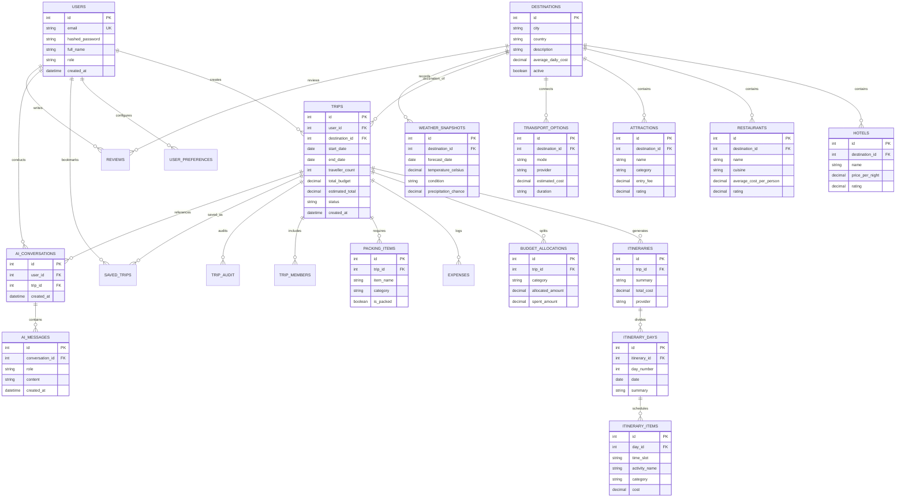

# RoamGenie — Entity-Relationship (ER) Diagram

## 1. Complete System ER Diagram (Mermaid)

---

## 2. Cardinality & Relationship Breakdown

1. **User → Trips (1 : N):** One registered user can create and persist multiple multi-day travel trips.
2. **Destination → Catalogue Entities (1 : N):** Each destination hosts multiple hotels, restaurants, attractions, and transport options.
3. **Trip → Itineraries (1 : N):** A trip generates one active itinerary (and optional historical iterations).
4. **Itinerary → Days → Items (1 : N : M):** An itinerary breaks down into discrete day slots, which host temporal activity items (morning, afternoon, evening).
5. **Trip → Budget Allocations (1 : N):** A trip manages category-specific allocations (Stay, Food, Sightseeing, Transport).
6. **Conversation → Messages (1 : N):** An AI chat conversation logs individual user queries and assistant responses.
